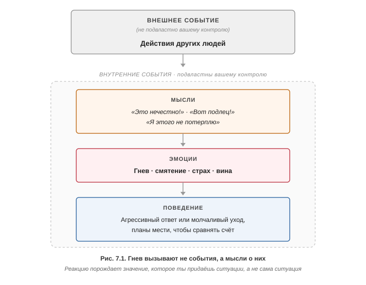

# Глава 7. Вы злитесь? Каков ваш IQ?

IQ здесь — не интеллект, а показатель раздражительности (Irritability Quotient): сколько гнева и раздражения держишь в себе в повседневной жизни.

## Показатель раздражительности (шкала Новако)

25 потенциально расстраивающих ситуаций, каждая оценивается от 0 (не раздражает) до 4 (очень разозлюсь). Сумма — от 0 до 100.

- 0–45 — удивительно низкая раздражительность.
- 46–55 — миролюбивее большинства.
- 56–75 — средняя степень.
- 76–85 — значительно выше средней.
- 86–100 — «чемпион раздражительности»: частые острые вспышки, обида держится долго после инцидента, головные боли напряжения, повышенное давление.

## Три способа обойтись с гневом

1. Направить внутрь — считается нездоровым. Фрейд полагал, что направленный на себя гнев вызывает депрессию; убедительных доказательств у этой точки зрения нет.
2. Выразить наружу — считается здоровым, но неэффективно: так не научишься общаться без гнева.
3. Когнитивное решение — перестать создавать гнев. Тогда выбор между первыми двумя не нужен.

## Гнев создают мысли, а не события

Чувства порождает значение, которое придаёшь ситуации, а не сама ситуация (рис. 7.1). Ребёнок вышел из спальни: «не даёт покоя» — раздражение, «стал самостоятельнее» — радость.

Гнев — обоюдоострый клинок: страдание от собственной вспышки часто превышает вред от повода (хозяйка ресторана швырнула котелок супа, потом два дня убеждала себя, что была в праве).

## Четыре искажения, порождающие гнев

1. Навешивание ярлыков (демонизация) — «козёл», «сволочь»: гнев направлен не на поступок, а на то, кем человек является. Складываешь всё плохое (негативный фильтр), игнорируешь хорошее (обесценивание положительного). Под этим обычно защита самооценки: другой задел, обидел или не согласился, и ссора кажется дуэлью чести. Но поднять свою ценность за счёт принижения другого нельзя, а отнять у тебя самоуважение способны только твои собственные искажённые мысли (гл. 4) — больше ни у кого в мире нет такой власти.
2. Чтение мыслей — домысливаешь мотивы не в пользу другого. Джоан: муж выбрал футбол вместо концерта → «он меня не любит, всегда по-своему, это нечестно». В итоге к отсутствию мужа на концерте добавляется иллюзия нелюбви.
3. Преувеличение — «я так больше не могу», хотя стоишь и терпишь, значит можешь.
4. «должен» / «не должен» — требование, чтобы мир жил по твоим правилам.

Гнев вызывает не потеря желаемого (она даёт лишь утрату и неудобство), а предшествующая мысль «мне полагалось это получить» — она и делает ситуацию несправедливой. В основе «должен» лежит убеждение, что мгновенное вознаграждение положено всегда.

## Относительность справедливости

Гнев — эмоция, возникающая при мысли, что с тобой обходятся нечестно. Но абсолютной справедливости не существует, как абсолютного времени у Эйнштейна: лев по отношению к овце нечестен с её точки зрения и честен со своей. Мораль при этом полезна и нужна — просто это договорённости, а не объективные факты. Обвиняя другого в несправедливости, ты подразумеваешь, что все разделяют твой взгляд; он же действует по своим стандартам и себе кажется справедливым.

Обратная крайность (Уэйн Дайер: справедливости нет, гнев бесполезен) — то же мышление «всё или ничего» и сверхобобщение. Вопрос не «злиться или нет», а где граница адаптивного гнева.

## Когда гнев адаптивен: два критерия

1. Направлен ли гнев на того, кто сознательно, преднамеренно и неоправданно попытался причинить вред?
2. Полезен ли он — помогает достичь цели или просто вредит?

Соперник бьёт локтем: злость помогает играть жёстче (адаптивна), после игры не нужна. Сердитый тон ребёнку про проезжую часть адаптивен, хотя вреда он не хотел. Ярость из-за газетной жестокости неадаптивна, пока ничего не делаешь, — и становится адаптивной, если включаешься в помощь жертвам.

## Методы снижения гнева

Гнев меняется тяжелее прочих эмоций: он моралистичен, его защищают «религиозным рвением». Подход гибкий — разным провокациям нужны разные методы.

### 1. Плюсы и минусы гнева

Выписать в две колонки преимущества и недостатки гнева и мстительного ответа, кратко- и долгосрочные, и спросить: чего больше? Список Сью (табл. 7.1) убедил её, что издержки перевешивают. Отдельно она перечислила, что улучшится при меньшем гневе: больше нравлюсь людям, предсказуемее, лучше владею эмоциями, расслабленнее, комфортнее с собой, воспринимают как не осуждающего человека, веду себя по-взрослому, больше получаю через спокойные переговоры, больше уважения от близких.

Задание. Бёрнс настаивает, что такой список надо составить и самой — это первый шаг работы с гневом. Контрольный вопрос после него: если ситуация не изменится сразу, согласна ли я с ней поработать, а не злиться? Ответ «да» означает, что мотивация к изменениям есть.

Вид приёма: [«Плюсы / минусы (за/против)»](00_Recurring-Techniques-and-Tables.md).

#### Таблица 7.1 — Анализ преимуществ и недостатков гнева

| Преимущества моего гнева | Недостатки моего гнева |
|---|---|
| 1. Когда я злюсь, то чувствую себя хорошо | 1. Это ещё больше испортит наши отношения с Джоном |
| 2. Джон поймёт, что я очень не одобряю то, что он делает | 2. Ему захочется отрицать всё, что я говорю |
| 3. Я *вправе* слететь с катушек, если мне так хочется | 3. Я часто чувствую себя виноватой и сожалею о произошедшем после того, как слетаю с катушек |
| 4. Он будет знать, что об меня нельзя вытирать ноги | 4. Он, возможно, отомстит мне и разозлится в ответ, так как тоже не любит, когда его кто-то использует в своих интересах |
| 5. Я покажу ему, что я не терплю, когда мной злоупотребляют | 5. Мой гнев мешает нам обоим исправить проблему, которая является первопричиной разлада. Он препятствует конструктивному обсуждению проблем и уводит нас в сторону от настоящего поиска решения |
| 6. Пусть я и не получу то, чего хочу, по крайней мере я смогу насладиться местью, увижу, как он корчится и испытывает ту же боль, что и я. Затем ему придётся вести себя как следует | 6. В одну минуту я на коне, в другую — повержена. Из-за моей раздражительности люди вокруг меня не знают, чего ожидать. На меня лепят ярлыки: «у неё скверный характер», «капризная», «испорченная», «незрелая». Они видят во мне избалованного ребёнка |
| | 7. Так я могу превратить своих детей в невротиков. Со временем они начнут избегать моих вспышек гнева и скорее предпочтут держаться от меня подальше, чем обращаться за помощью |
| | 8. Джон может вообще бросить меня, если ему надоест моя стервозность и постоянные упреки |
| | 9. Неприятные чувства, которые у меня возникают, делают меня несчастной. Жизнь становится горькой, и я постепенно лишаюсь радости и креативности, которые так сильно ценила ранее |

### 2. Остудить «горячие» мысли

Записать без цензуры «горячие» мысли и заменить их «прохладными» — объективными и менее провокационными (табл. 7.2). Сью так перестала давить на мужа, решив, что он имеет право быть неправым. Для более полной работы — дневник с оценкой гнева до и после (табл. 7.3): молодая женщина после резкого отказа по телефону снизила злость с 98 % до 15 %, поняв, что относилась к себе в десять раз хуже, чем собеседник.

Вид приёма: [«Две колонки (мысли/ответы)»](00_Recurring-Techniques-and-Tables.md); дневник — [«Дневник (5–6 колонок)»](00_Recurring-Techniques-and-Tables.md).

#### Таблица 7.2 — «горячие» и «прохладные» мысли (Сью)

| «Горячие» мысли | «Прохладные» мысли |
|---|---|
| 1. Как он смеет меня не слушать! | 1. Да легко! Он не обязан всё делать по-моему. Кроме того, он *слушает меня*, но занял защитную позицию, потому что я веду себя слишком настойчиво |
| 2. Сэнди врёт. Она говорит, что работает, а на самом деле — нет. И после этого она ожидает от Джона помощи | 2. Это в её природе — врать, лениться и использовать людей, когда речь заходит о работе в школе. Она ненавидит работу. Это её проблема |
| 3. У Джона не так много свободного времени, и, если он будет проводить его, помогая Сэнди, мне придётся быть в одиночестве и заботиться о детях самой | 3. И что? Мне нравится быть одной. Я способна позаботиться о своих детях самостоятельно. Я не беспомощна. Я могу это сделать. Возможно, он захочет проводить со мной больше времени, если я научусь не злиться всё время |
| 4. Сэнди отнимает у меня время Джона | 4. Это правда. Но я большая девочка. Я могу потерпеть и побыть какое-то время в одиночестве. Я бы не была так расстроена, если бы он занимался моими детьми |
| 5. Джон идиот, а Сэнди использует людей | 5. Он уже большой мальчик. Если он захочет помогать Сэнди, он это сделает. Не лезь в это. Это не моё дело |
| 6. Я так больше не могу! | 6. Я могу. Это только временная проблема. Я выносила и худшее |
| 7. Я похожа на избалованного ребёнка. Моё чувство вины заслуженно | 7. Я имею право иногда вести себя незрело. Я не совершенна и не нуждаюсь в этом. Необязательно чувствовать себя виноватой. Это не поможет |

#### Таблица 7.3 — Дневник записи автоматических мыслей (звонок по вакансии)

| Провоцирующая ситуация | Эмоции | «Горячие» мысли | «Прохладные» мысли | Результат |
|---|---|---|---|---|
| Позвонила по объявлению о вакансии оператора по набору медицинских текстов с частичной занятостью. В объявлении говорилось, что требуется «некоторый опыт». Во-первых, ответивший даже не рассказал, что у них за компания. И затем сразу же мне отказал, потому что был «не уверен, что у меня достаточно опыта»! | Злость. Ненависть. Отчаяние. 98% | 1. Вот козёл! *Какого чёрта он о себе возомнил!* У меня более чем достаточно опыта | 1. Почему меня это так вывело из себя? В любом случае мне не понравился его тон. Он даже не дал мне по-настоящему объяснить, какой у меня опыт. Я знаю, что хорошо справляюсь с работой, поэтому то, что я не получила эту работу, — не моя вина, а его. Более того, разве мне бы хотелось работать у кого-то вроде него? | Злость. Ненависть. Отчаяние. 15% |
| | | 2. Это была лучшая вакансия в газете, а я её упустила | 2. Я делаю из этого слишком большую проблему. Есть множество других вакансий, которые могут мне подойти | |
| | | 3. Родители убьют меня | 3. Конечно, не убьют. По крайней мере я пытаюсь | |
| | | 4. Я расплачусь | 4. Разве это не смешно? Почему я позволяю кому-то доводить себя до слёз? Здесь нечего лить слёзы. Я знаю, чего я стою, вот что имеет значение | |

### 3. Воображаемые сцены

Фантазии о мести держат гнев живым месяцами; режиссёр и единственный зритель этого фильма — ты сама, и адреналин с давлением тоже твои. Три приёма:

1. Преобразить образ юмором — обидчик в подгузнике посреди торгового центра.
2. Остановка мысли — прекратить прокручивать фильм и занять себя другим.
3. Энергичная физнагрузка — перенаправить возбуждение в полезное русло.

### 4. Переписать правила «должен»

- Сью: «если я хорошая и верная жена, то заслуживаю любви» → любой недостаток внимания читался как подтверждение её несостоятельности, и она постоянно боролась, боясь потерять чувство собственного достоинства; отсюда манипуляции и страх. Новая версия: буду вести себя позитивно и рассчитывать на ответную любовь, но сохраню самоуважение, когда он ведёт себя иначе.
- Маргарет: «в браке всё должно быть 50 на 50», и шире — «если я делаю людям добро, они должны отвечать тем же». Она постоянно делала хорошее мужу и другим, а потом ждала взаимности, но эти односторонние контракты разваливались: люди попросту не знали, что от них ждут вознаграждения (волонтёрила в благотворительной организации ради должности — взяли другого кандидата). Новая версия: взаимность — не данность, а временный и неустойчивый идеал, к которому только приближаются через консенсус, общение, компромисс и рост; это требует умения договариваться и напряжённой работы. Ожидая меньшего, Маргарет получила больше.

Универсальный ход — заменять «должен» на «было бы хорошо, если бы» (табл. 7.4).

#### Таблица 7.4 — Пересмотр правил со словом «должен»

| Деструктивное правило со словом «должен» | Исправленная версия |
|---|---|
| 1. Если я хорошо отношусь к людям, они должны это ценить | 1. Было бы здорово, если бы люди всегда ценили то, что я делаю, но это нереалистично. Они часто будут отвечать взаимностью, но иногда этого не будет происходить |
| 2. Незнакомцы должны вежливо обходиться со мной | 2. Большинство незнакомцев будут относиться ко мне вежливо, если я не буду вести себя, как будто обижена на весь мир. Конечно, всегда найдутся ворчуны, которые будут вести себя неприятно. Но зачем позволять им расстраивать себя? Жизнь слишком коротка, чтобы тратить время, концентрируясь на негативных деталях |
| 3. Если я буду над чем-то упорно работать, я должна получить это | 3. Это просто смешно. У меня нет гарантий, что я всегда буду во всём успешной. Я не совершенна и не обязана быть такой |
| 4. Если кто-то обходится со мной несправедливо, я должна разозлиться, потому что у меня есть такое право и потому что это делает меня более человечной | 4. Все люди имеют право на то, чтобы разозлиться, независимо от того, обходятся с ними справедливо или нет. Единственный вопрос — выиграю ли я от того, что разозлюсь? Хочу ли я испытывать злость? Каковы будут потери и выгоды? |
| 5. Люди не должны поступать со мной так, как я бы не поступила с ними | 5. Чепуха. Никто не хочет жить по моим правилам, так зачем ожидать, что кто-то будет это делать? Люди будут часто обходиться со мной так, как я обхожусь с ними, но не всегда |

### 5. Ожидать неадекватного поведения

Разочарование складывается из двух ингредиентов: плохой поступок другого и ожидание, что он должен вести себя иначе. Если человек меняться не собирается, убирают второй. Памятка Сью «Почему Сэнди должна вести себя отвратительно»: она манипулятор по природе, считает внимание положенным по праву, значит, будет так себя вести, пока не изменится, — удивляться нечему. Как менять свою реакцию:

1. поблагодарить за кражу — она же «должна» так делать;
2. про себя смеяться над детскими манипуляциями;
3. сердиться только если гнев нужен для конкретной цели;
4. при потере самоуважения спрашивать: хочу ли я давать такую власть надо мной ребёнку?

Расстраиваясь, Сью давала Сэнди ровно то, чего та добивалась.

### 6. Грамотные манипуляции: вознаграждение вместо наказания

Опасение «об меня будут вытирать ноги, если я перестану злиться» отражает чувство собственной непригодности и нехватку грамотных способов получать желаемое. Психолог Марк Гольдштейн работал с жёнами, которые злились на невнимательных мужей, и перенёс на эти пары лабораторный принцип: любое живое существо эффективнее менять вознаграждением желаемого поведения, чем наказанием нежелательного — наказание даёт обиду, отчуждение и избегание. Жёны из его практики как раз пытались добиться своего наказанием; переключение на вознаграждение давало разительные перемены. Жена Х. вернула ушедшего мужа: измеряла частоту его звонков на графике, сама не звонила, тепло откликалась, обезоруживала согласием, обрывала разговор раньше, чем он наскучит, держала в морозилке любимые сигары к его визитам. Гарантий приём не даёт, но заодно смещает фокус на позитив в людях.

### 7. Снижение требований

Выписать в две колонки все причины, почему другой «не должен был» так поступать, и опровергнуть каждую (табл. 7.5). Основание: неправда, что тебе полагается желаемое просто потому, что ты этого хочешь. Половина всех плотников (и дантистов, и писателей) по определению ниже среднего — кипеть бессмысленно, надо вести переговоры.

#### Таблица 7.5 — причины «должен» и опровержение (плотник и шкафы)

| Причины, *по которым ему следовало бы больше стараться, выполняя свою работу* | Опровержение |
|---|---|
| 1. Потому что я заплатил ему полную стоимость | 1. Ему платят те же деньги, он старается сверх положенного или нет |
| 2. Потому что выполнять свою работу хорошо — это просто прилично | 2. Возможно, он посчитал, что выполнил работу нормально. А облицовка, которую он сделал, и правда выглядит неплохо |
| 3. Потому что он должен убедиться в том, что сделал всё хорошо | 3. Почему он должен это делать? |
| 4. Потому что я бы именно так и делал, если бы был плотником | 4. Но он не я и не пытается соответствовать моим стандартам |
| 5. Потому что ему стоит больше беспокоиться о результатах своего труда | 5. У него нет причин беспокоиться больше. Одни плотники относятся к своей работе с увлечением, а для других это просто работа |
| 6. Так почему *мне* достаётся такой, который делает свою работу кое-как? | 6. Все, кто работал над строительством самого дома, сделали работу добросовестно. Нельзя ожидать, что абсолютно все, кто работает на тебя, будут звёздами. Это просто нереалистично |

### 8. Стратегии переговоров

Спокойный, твёрдый, напористый подход вместо гнева. Три хода, повторяемые по кругу:

1. похвалить за то, что сделано хорошо, и тактично обозначить проблему;
2. обезоружить спорящего — согласиться с долей истины;
3. снова спокойно прояснить свою цель.

Ультиматумы — только в крайнем случае и только если готова их исполнить. Недовольство выражать без ярлыков: «мне досадно видеть плохо сделанную работу, когда вижу, что вы способны на большее», а не «это полный провал».

Гнев и моралистичные «должен» сами загоняют собеседника в оборону и контратаку. Разбор механизма целиком — что включает защитную реакцию у него и у меня и чем её обходят: [Защитная реакция](00_Recurring-Techniques-and-Tables.md).

### 9. Точная эмпатия

Полное противоядие от гнева. Это не сочувствие (чувствовать то же самое) и не поддержка (вести себя деликатно), а способность настолько точно понять мысли и мотивы другого, что он скажет: «да, именно это я и имел в виду». Понимание мотива обычно само опровергает гневную мысль.

- Бизнесмен в ролевой игре сыграл официанта, забывшего налить вино, и увидел: тот не считал его пустым местом, а засмотрелся на девушку. Искажение — чтение мыслей; из-за него казалось, что надо ответить, чтобы сохранить самолюбие.
- Мелисса сыграла изменившего мужа Говарда и увидела безвыигрышную ситуацию, созданную его нерешительностью, а не её несостоятельностью, — многолетний гнев исчез. Ключ к её гневу — страх потерять чувство собственного достоинства: под ним лежал силлогизм «если я хорошая жена, муж обязан меня любить» → «он неверен» → «значит, я плохая жена или он подлец», и злость была единственной в этой системе правил альтернативой потере самооценки. Эмпатия сняла грандиозность предпосылки: за свою неразбериху отвечал он. Мелисса перестала считать себя ответственной за поступки мужа — и самооценка от этого выросла.

### 10. Мысленная репетиция

Гнев взрывной и эпизодический — контроль теряется раньше, чем вспомнишь про техники, поэтому его нейтрализуют заранее:

1. составить «иерархию гнева» от +1 до +10 (табл. 7.6);
2. взять пункт полегче и живо представить себя внутри ситуации;
3. записать «горячие» мысли и вспышку, оценить расстройство в процентах;
4. прогнать тот же сценарий с «прохладными» мыслями и спокойным, уверенным разрешением, закончив хорошим исходом;
5. практиковать каждую ночь и двигаться дальше по иерархии.

Отдельно репетируют и негативный исход. Ожидание грубости повышает её вероятность через самосбывающееся пророчество. Прогресс не оценивают в стиле «всё или ничего»: снижение с 99 % до 70 % — уже успех. Полезный ресурс — спросить друзей, как они думают и поступают в такой ситуации.

#### Таблица 7.6 — Иерархия гнева

| Ранг | Ситуация |
|---|---|
| +1 | Я сижу в ресторане пятнадцать минут, а официант не приходит. |
| +2 | Я звоню другу, а он не берёт трубку и не перезванивает. |
| +3 | Клиент отменяет встречу в последнюю минуту без объяснения причин. |
| +4 | Клиент без предупреждения не приходит на встречу. |
| +5 | Кто-то яростно критикует меня. |
| +6 | Группа нахальных подростков толпится передо мной в очереди в кино. |
| +7 | Я читаю в газете о какой-то немотивированной жестокости, например изнасиловании. |
| +8 | Клиент отказывается оплатить счёт за товары, которые я доставил, и уезжает из города, так что я не могу потребовать с него эти деньги. |
| +9 | Местные правонарушители постоянно срывают мой почтовый ящик посреди ночи уже несколько месяцев. Я никак не могу поймать их или остановить. |
| +10 | Я смотрю по телевизору репортаж о том, что кто-то, предположительно группа подростков, ворвался в зоопарк ночью и забросал камнями несколько мелких птиц и животных до смерти, а ещё несколько искалечил. |

## Десять вещей о гневе (итог)

1. Ни одно событие само по себе не злит — гнев порождают «горячие» мысли; ответственность за него даёт контроль.
2. Чаще гнев не помощник, а паралич; лучше искать решение. Если ситуация неподвластна — тем более незачем злиться.
3. Мысли, порождающие гнев, обычно содержат искажения; их исправление снижает гнев.
4. В основе гнева — убеждение, что с тобой обошлись нечестно; интенсивность растёт с ощущением умышленного зла.
5. Взгляд глазами другого часто показывает, что несправедливость — иллюзия в твоей голове.
6. Возмездие настраивает людей против тебя; положительное подкрепление работает лучше.
7. Чаще всего гнев защищает самооценку — и всегда неадекватен, ведь отнять самоуважение могут лишь твои собственные искажённые мысли.
8. Отчаяние — следствие несбывшихся ожиданий; проще изменить ожидания, чем реальность. Типичные нереалистичные ожидания:
   - если я чего-то хочу, я это заслуживаю;
   - если я много работаю, я должна добиться успеха;
   - другие должны соответствовать моим стандартам и моей концепции справедливости;
   - я должна решать любые проблемы быстро и легко;
   - если я хорошая жена, муж обязан меня любить;
   - люди должны думать и действовать так же, как я;
   - если я хорошо отношусь к людям, они должны отвечать взаимностью.
9. «Я имею право злиться» — детский каприз: право есть, вопрос — выигрываешь ли ты от гнева.
10. Гнев редко нужен, чтобы оставаться человеком; без него больше вкуса к жизни, покоя и продуктивности.
