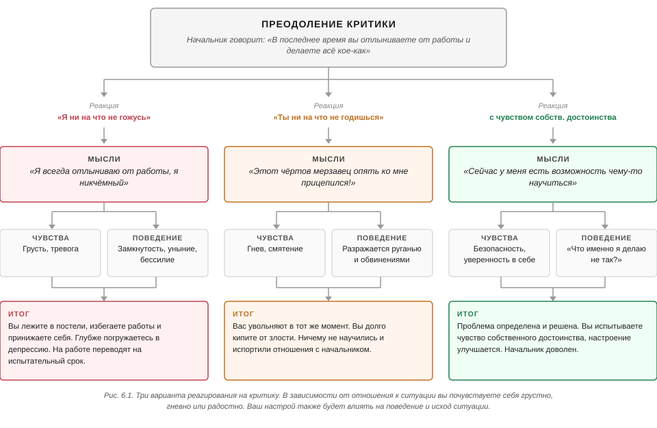

# Глава 6. Вербальное дзюдо: учитесь давать отпор критике

Глава о том, как выдерживать словесное нападение, не обороняясь и не теряя самоуважения. Состоит из двух частей: сначала
работа с собственными мыслями (когнитивная), затем три словесных шага — эмпатия, разоружение, обратная связь и
переговоры.

Практика. Бёрнс сразу предупреждает: чтобы победить страх перед критикой, нужна регулярная практика, но развить и
усовершенствовать этот навык не так уж сложно, а его положительное влияние на самооценку будет огромным. Задания он даёт
по ходу главы в нескольких местах — ниже они помечены.

## Почему критика ранит

Ощущение никчёмности держится на самокритике — внутреннем диалоге, где ты сурово и необоснованно на себя нападаешь.
Чужое резкое замечание чаще всего просто запускает этот диалог. Страшно от критики становится не потому, что она сильна,
а потому что нет способа на неё отвечать.

Главное утверждение главы: чужая критика не расстроила тебя ни разу в жизни. Какими бы злобными и жестокими ни были
слова, сами по себе они не способны вызвать даже небольшого беспокойства. Унизить тебя может только один человек — ты
сама.

Механизм: критика → автоматические негативные мысли → эмоция. Реакцию порождает средний элемент, а не слова другого, и в
этих мыслях всегда есть искажения из главы 3.

### Случай Арта

Ординатор-психиатр Арт узнал от руководителя, что пациент пожаловался на его резкие замечания на сессии. Арт впал в
панику и депрессию: «О боже! Вся правда обо мне выплыла наружу. Даже мои пациенты видят, какой я никчёмный и
бесчувственный человек. Меня, вероятно, выгонят из ординатуры».

Панику вызвала автоматическая негативная мысль: «эти критические замечания показывают, насколько я бесполезен».

Какие ошибки мышления он при этом совершил:

1. шкала оценки допускает только «безупречен» или «бесполезен», промежуточных значений нет (мышление «всё или ничего»);
2. опрометчиво заключил, что критические замечания пациента были вескими и обоснованными, — вес чужого мнения раздут до
   приговора (преувеличение чужого мнения, катастрофизация; сам Бёрнс искажение в этом пункте не называет). Что с этим
   делать — [ранжирование объяснений по правдоподобности и проверка фактами](../Бек-Когнитивная-терапия-депрессии/Ранжирование-объяснений-по-правдоподобности.md);
3. преувеличил, насколько недипломатично прозвучали его слова (преувеличение);
4. решил, что исправить своё поведение не сможет (ошибка предсказания);
5. заключил, что его отвергнут и уничтожат профессионально, раз он будет бесконечно повторять ту же ошибку
   (сверхобобщение);
6. сконцентрировался исключительно на своей ошибке (негативный фильтр);
7. пренебрёг своими многочисленными профессиональными успехами (обесценивание положительного);
8. отождествил себя с поступком: «я никчёмный и бесчувственный человек» (навешивание ярлыка).

Первый шаг работы — записать эти мысли в две колонки и найти на них рациональные ответы (табл. 6.1). Когда Арт стал
думать о ситуации реалистичнее, силы ушли не на катастрофические сценарии, а на дело: он выяснил, какие именно слова
задели пациента, и изменил свой стиль общения. В результате он повзрослел профессионально, стал увереннее и меньше
боялся быть несовершенным.

#### Таблица 6.1 — техника двух колонок (домашняя работа Арта)

Выдержка из письменного домашнего задания Арта. Записав свои негативные мысли, он увидел, насколько они далеки от
реальности, и почувствовал значительное облегчение.

| Автоматические мысли (самокритика)                                                                                | Рациональные ответы (самозащита)                                                                                                                                                                                                                                                  |
|-------------------------------------------------------------------------------------------------------------------|-----------------------------------------------------------------------------------------------------------------------------------------------------------------------------------------------------------------------------------------------------------------------------------|
| 1. О боже! Вся правда обо мне выплыла наружу. Даже мои пациенты видят, какой я никчёмный и бесчувственный человек | 1. Только из того, что один пациент жалуется, не следует, что я «никчёмный и бесчувственный человек». На самом деле большинству пациентов я нравлюсь. То, что я совершил ошибку, не обнаружило мою «истинную сущность». Любой может совершить ошибку                              |
| 2. Меня, вероятно, выгонят из ординатуры                                                                          | 2. Это глупо и основывается на нескольких ошибочных предположениях: a) я совершаю только плохие поступки; b) я не способен на лучшее. Поскольку оба предположения нелепы, очень маловероятно, что моему положению здесь что-то угрожает. Руководитель не раз хвалил меня |

### Развилка: замечание верно или ошибочно

- Ошибочно — огорчаться не из-за чего: ошибся сам критик, его оценка несправедлива. Это его промах, а не твой; ждать,
  что окружающие будут во всём безупречны, не стоит.
- По делу — чувствовать себя несостоятельной всё равно незачем: безупречности от тебя никто не ждёт. Признать ошибку и
  предпринять шаги к исправлению.

Звучит просто и таковым является, но чтобы это стало эмоциональной реальностью, а не рассуждением, нужна практика.

Отдельный корень страха критики — убеждение, что для собственной ценности и счастья нужны любовь и одобрение других.
Тогда вся энергия уходит на угождение, и на творческую продуктивную жизнь её не остаётся. Парадокс: угождающий человек
многим кажется менее интересным, чем его более самоуверенные друзья.

Задание. Прямо сейчас записать негативные мысли, которые обычно крутятся в голове, когда меня критикуют. Затем найти в
них искажения и заменить более объективными и рациональными ответами — то есть проделать с собой ровно то, что Арт
сделал в таблице 6.1. Это уменьшает и злость, и страх перед критикой.

## Шаг 1. Эмпатия

Критикующий может хотеть помочь, а может — навредить; сказанное бывает верным, ошибочным или чем-то средним. Разбираться
в этом сразу не нужно. Первая задача — выяснить, что именно человек имеет в виду.

- Задавать конкретные вопросы, избегая осуждающего и оборонительного тона.
- Всегда просить больше конкретики. На расплывчатый ярлык — просить назвать, что именно не нравится.
- Если человек ругается и навешивает ярлыки, всё равно запрашивать информацию: что эти слова значат, чем именно ты его
  обидела, что сделала, когда, как часто, что ещё ему не нравится.
- Смотреть на ситуацию его глазами: что твои действия означают для него.

Пример диалога (Бёрнс в роли атакуемого):

> — Доктор Бёрнс, вы никчёмный и подлый человек.  
> — И что же во мне подлого?  
> — Всё, что вы говорите и делаете. Вы бесчувственный, эгоцентричный и некомпетентный.  
> — Давайте по порядку, я хочу, чтобы вы говорили конкретно. Что именно из сказанного мной прозвучало бесчувственно?
> Из-за чего сложилось впечатление, что я эгоцентричен?  
> — Когда я звонил перенести встречу, вы говорили торопливо и раздражённо, будто вам на меня наплевать.  
> — Хорошо, я говорил с вами по телефону торопливо и невнимательно. Что ещё я сделал, что вызвало ваше раздражение?

Что здесь происходит: глухое «вы подлец» превращается в конкретные эпизоды, которые можно обсуждать. Полное отвержение
становится менее вероятным, критик получает возможность высказаться и видит, что его слушают. Взаимодействие сдвигается
от схемы «защита и нападение» к сотрудничеству. Правило: отвечать эмпатией и уточняющими вопросами, даже если критика
кажется абсолютно несправедливой.

## Шаг 2. Разоружение оппонента

Если в тебя стреляют, есть три варианта:

1. стрелять в ответ — война и взаимное уничтожение;
2. убегать и уворачиваться от пуль — унижение и потеря самоуважения;
3. остаться на месте и разоружить противника — единственный вариант, где победителями чувствуют себя оба.

Способ разоружения один: независимо от того, прав критик или нет, найти способ с ним согласиться.

- Если он прав — согласиться прямо, добавить, что обидеть не хотела, и предложить, как исправить.
- Если он неправ — согласиться с критикой в принципе, или найти зерно правды в сказанном, или признать, что понимаешь,
  насколько его огорчает его восприятие ситуации.

Правила, которых Бёрнс держится в ролевой игре с заведомо ложными обвинениями: найти способ согласиться, что бы ни было
сказано; избегать сарказма и оборонительной манеры; всегда говорить правду.

Пример диалога с заведомо ложными нападками:

> — Доктор Бёрнс, вы полный неудачник.  
> — Я иногда чувствую себя неудачником. Я частенько делаю глупости.  
> — Эта ваша когнитивная психология никуда не годится!  
> — Безусловно, ещё многое предстоит улучшить.  
> — Вы глупы.  
> — Есть люди куда более умные, чем я. Я точно не самый умный человек в мире.  
> — Вы некомпетентны и не заслуживаете доверия.  
> — Мне ужасно жаль, что я кажусь вам некомпетентным, вас это наверняка сильно беспокоит. Похоже, вам сложно мне
> довериться. Вы абсолютно правы: без взаимного уважения и совместных усилий работать успешно мы не сможем.

Разгневанный критик к этому моменту обычно выпускает пар: нападки не отражают, соглашаются — и боеприпасы у него
кончаются. Это победа через уклонение от сражения.

Задание по книге. Дальше в главе Бёрнс меняется ролями: нападает он, отвечает читатель. Чтобы упражнение сработало,
нужно прикрыть в книге строки, начинающиеся со слова «Вы», придумать свои ответы через эмпатию и разоружение и только
потом сверить с авторскими — насколько близко получилось.

### Ловушка: желание защищаться

Когда обвиняют несправедливо, возникает глубокое и почти непреодолимое желание оправдываться. Бёрнс называет это
ОГРОМНОЙ ошибкой: поддавшись, обнаружишь, что интенсивность нападок выросла. Парадокс в том, что каждой попыткой
защититься ты непроизвольно пополняешь арсенал противника боеприпасами.

Как выглядит провал:

> — Доктор Бёрнс, вам наплевать на пациентов.  
> — Это неправда и несправедливо. Вы не знаете, о чём говорите! Мои пациенты ценят, как усердно я работаю.  
> — Что ж, а я не ценю. Прощайте.

Пациент уходит и прекращает терапию. Ответ через эмпатию, наоборот, даёт человеку ощущение, что его слушают и уважают:
боевой пыл спадает, и появляется почва для третьего шага.

### Как тренироваться

Отрабатывать в ролевой игре с другом: он нападает, ты отвечаешь эмпатией и разоружением, потом меняетесь. Если играть не
с кем — записывать воображаемые диалоги: реплика враждебного критика, под ней твой ответ. Сорваться в спор и оправдания
в реальной ситуации поначалу нормально; важно потом разобрать эпизод и проиграть его заново в разных вариантах, пока не
найдётся комфортная стратегия.

## Шаг 3. Обратная связь и переговоры

После того как ты выслушала оппонента и разоружила его, можно решительно и тактично изложить свою позицию.

- Свести конфликт к фактам, а не к ущемлённой гордости и переходу на личности. Без ярлыков: ошибка не делает оппонента
  глупым, никчёмным или неполноценным.
- Излагать свою точку зрения объективно, признавая вероятность, что неправа ты.
- Разногласия о вкусах решаются так же — вежливо обозначить свой выбор и его причину.
- Если оппонент повторяет один и тот же довод по кругу — вежливо, но твёрдо повторять свою позицию, пока он не утомится.
- Где возможно — компромисс и частичное удовлетворение желаний.
- Если неправа очевидно ты — убедительно согласиться, поблагодарить за информацию и извиниться за обиду. Уважение к тебе
  от этого резко вырастает.

Пример с ошибочной претензией (пациентка заявила, что ей выставили счёт за уже оплаченную сессию, хотя была неправа):

> — Почему у вас отчётность не в порядке?!  
> — Возможно, мои записи и впрямь неверны. Я припоминаю, что в тот день вы забыли чековую книжку, но, возможно, я путаю.
> Надеюсь, вы допускаете, что каждый из нас время от времени ошибается, — так нам будет намного свободнее друг с другом.
> Почему бы не проверить, нет ли у вас аннулированного чека? Выясним правду и внесём исправления.

Такой ответ позволил ей сохранить лицо и избежать конфронтации, угрожающей её самооценке. Она оказалась неправа, но
потом сказала, что почувствовала облегчение: она боялась встретить ту же требовательность и перфекционизм, с какими
относилась к себе самой.

Пример вкусового разногласия (пациенту не нравится, что Бёрнс носит костюм и выглядит «официальным лицом»):

> — Безусловно, костюм — это несколько официально, и вам было бы комфортнее работать со мной, одевайся я непринуждённее.
> Но я перепробовал разные стили и пришёл к выводу, что костюм или пиджак наиболее приемлемы для большинства людей, с
> которыми я работаю. Поэтому я решил его придерживаться. Надеюсь, это не помешает нам работать вместе.

Если собеседник продолжит настаивать: «Я очень хорошо понимаю вашу точку зрения, и в ней есть определённая доля правды.
Тем не менее на данный момент я решил придерживаться более формального стиля».

## «А разве у меня нет права защищаться?»

Право есть, и злиться никто запретить не может; часто ошибается именно оппонент, а не ты. Но ключевой вопрос не в том,
выражать ли чувства, а в том, как.

- «Я злюсь на тебя, потому что ты меня критикуешь, и вообще ты подлец» — портит отношения и снижает шанс на продуктивный
  разговор в будущем.
- Вспылить приятно в моменте, но в долгую это сожжённые мосты, потерянная возможность понять, что оппонент пытался
  донести, и депрессивная отдача: за вспышку потом казнишь себя.

Отдельно Бёрнс отвечает коллегам-психотерапевтам. Фрейд считал депрессию «гневом, обращённым внутрь», и многие терапевты
на этом основании поощряют пациентов принимать и чаще выражать гнев, а описанные здесь техники называют вытеснением и
бегством от действительности. Эту позицию Бёрнс приводит, чтобы её опровергнуть: такой вывод неверен.

## Техника общения с теми, кто перебивает и задаёт слишком много вопросов

Разработана для лекций. Признаки такого слушателя:

1. замечания резко осуждающие, но неточные или не относящиеся к теме;
2. обычно исходят от человека, которого не особенно принимают и уважают коллеги;
3. подаются в форме обвинительной и оскорбительной речи.

Три хода:

1. немедленно поблагодарить за замечания;
2. признать, что поднятые вопросы действительно важны;
3. подчеркнуть, что по ним нужны дополнительные данные, предложить оппоненту самому провести исследование и продолжить
   обсуждение после лекции.

Гарантий не даёт ни одна словесная техника, но здесь результат почти всегда положительный: такие слушатели нередко
подходят потом поблагодарить и оказываются самыми признательными.

## Итог: три пути реакции на критику (рис. 6.1)

Когда тебя оскорбляют, ты немедленно выбираешь один из трёх путей, и выбор захватывает целиком — мышление, чувства,
поведение и даже реакции тела.

- Грусть — путь склонных к депрессии. Автоматически, без разбора, решаешь, что критик прав и ошибка твоя. Дальше
  преувеличиваешь её важность, сверхобобщаешь («вся жизнь — сплошная череда ошибок»), навешиваешь ярлык «полнейшей
  неудачницы», а из-за требования собственной безупречности приходишь к выводу, что ошибка означает полную никчёмность.
  Итог: депрессия, потеря чувства собственного достоинства, бесплодные пассивные ответы, избегание и прерывание общения.
- Гнев — защита от страха оказаться несовершенной: убеждаешь оппонента, что чудовище здесь он. Признать ошибку
  невозможно, потому что по перфекционистским стандартам это равно признанию своей никчёмности, поэтому лучшей защитой
  становится нападение. Тело в боевой готовности, в моменте — приятное возбуждение праведного негодования. Итог:
  оппонент не соглашается, отношения испорчены.
- Радость (достоинство) — исходишь из того, что ты достойный человек и совершенной быть не обязана, или ведёшь себя так,
  будто это уже так. Первая реакция — любопытство: есть ли в критике зерно истины, что именно я сделала, действительно
  ли это промах? Дальше вопросы, не навязывающие твою точку зрения, определение проблемы, переговоры или признание своей
  ошибки. Права ты как человек в любом случае, потому что чувство собственного достоинства вообще не поставлено на кон.

## Называние условия сотрудничества

Имя приёма моё: у Бёрнса он безымянный. В теоретической части главы 6 этот ход не описан вообще, но во всех трёх её диалогах автор им пользуется. Суть: собеседнику проговаривается, при каком условии совместная работа вообще возможна.

Три случая, в порядке появления в главе.

Разоружение при заведомо ложных нападках, после «вы некомпетентны и не заслуживаете доверия»:

> Мне ужасно жаль, что я кажусь вам некомпетентным. Должно быть, вас это сильно беспокоит. Похоже, что вам сложно довериться мне и вы искренне сомневаетесь в том, что мы можем эффективно работать вместе. Вы абсолютно правы, мы не сможем успешно работать без взаимного уважения и совместных усилий.

Обратная связь и переговоры, ошибочная претензия про счёт за уже оплаченную сессию:

> Я надеюсь, вы допускаете возможность, что вы или я будем время от времени совершать ошибки. В этом случае мы сможем чувствовать себя друг с другом намного свободнее.

Там же, разногласие о вкусах — пациенту не нравится, что психиатр носит костюм:

> Я надеюсь, что это не помешает нам продолжить совместную работу.

Что общего. Во всех трёх случаях ход идёт последним, уже после эмпатии и разоружения, и звучит мягко: «надеюсь», «мы сможем». В первом примере он вообще подан как согласие с критиком — «вы абсолютно правы», — то есть остаётся частью разоружения, а не превращается в контратаку.

Зачем он нужен (моя реконструкция, автор об этом не пишет). Приём возвращает симметрию. Разоружение по природе одностороннее: я принимаю правду собеседника, соглашаюсь снова и снова, причём с человеком, который называет меня никчёмной. Затянувшись, это начинает выглядеть и ощущаться как капитуляция. Условие сформулировано про обоих — «взаимное уважение», «каждый из нас время от времени ошибается», «продолжить совместную работу», — и этим возвращает вторую сторону в кадр: дело общее, и требования к нему обоюдны. В итоге я приняла критику, но не оказалась внизу.

Отсюда и место хода — всегда в конце, после серии согласий. Сказанный первым, он прозвучал бы как угроза; сказанный последним — восстанавливает равновесие.

Это не ультиматум, хотя похоже. В ультиматуме есть требование и санкция: сделай то-то, иначе будет то-то. Здесь ни требования, ни угрозы — просто названо свойство ситуации: без взаимного уважения работа не выйдет. Собеседник при этом сохраняет лицо и волен решать сам.

Сам термин «ультиматум» у Бёрнса появляется только в главе 7, в стратегиях переговоров: применять в крайнем случае и лишь тогда, когда готова исполнить. Там же в диалоге с плотником он помечает собственную реплику ремаркой «(Ультиматум.)» — там заказчик говорит, что не примет работу и не оплатит счёт, пока шкафы не исправят. То есть эти вещи Бёрнс различает и сам, просто в главе 6 второй ход не назвал.
