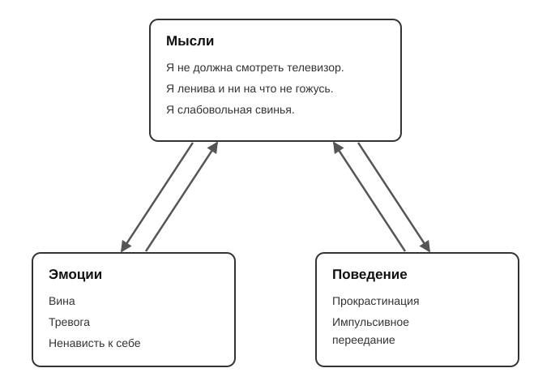
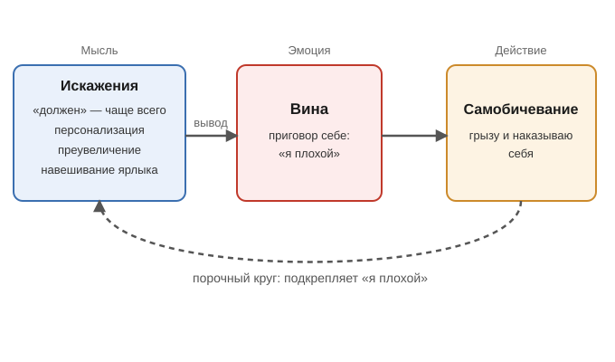

# Глава 8. Чувство вины

## Что такое вина (когнитивный подход)

Вина — это эмоция, которую вы испытываете при двух мыслях:

1. Я сделал то, что не должен был (или не сделал того, что должен был), и это не соответствует моим моральным стандартам или понятиям о справедливости.
2. Такое «плохое поведение» показывает, что я плохой человек (склонность причинять вред, испорченный характер и т. д.).

Идея о собственной «плохости» — основная причина вины. Без неё вредный поступок даёт лишь раскаяние, а не вину.

### Вина против раскаяния

- Раскаяние (сожаление) направлено на поведение: «я поступил плохо».
- Вина направлена на «Я»: «я плохой человек».
- Раскаяние возникает из адекватного понимания, что вы умышленно и необоснованно причинили вред, нарушив свои нормы; оно не подразумевает, что вы плохой, злой или аморальный.

### Три предположения (когда к вине добавляются другие чувства)

1. Моё «плохое поведение» делает меня неполноценным или бесполезным → приводит к депрессии.
2. Если бы другие узнали, что я сделал, они бы стали презирать меня → вызывает стыд.
3. Мне могут отомстить или наказать → вызывает тревогу.

Проверка, здоровые эти чувства или разрушительные: содержат ли они хоть одно из 10 когнитивных искажений (глава 3). Если да — вина нереалистична.

### Когнитивные искажения, порождающие вину

1. Преувеличение — раздуваете масштаб проступка («так ли это на самом деле ужасно?»).
2. Навешивание ярлыка — называете себя «плохим» или «испорченным» из-за поступка (то самое «суеверное» мышление, что вело к охоте на ведьм).
3. Персонализация — берёте ответственность за то, чего не делали (чужие чувства порождены их собственными искажёнными мыслями, а не вами).
4. Неадекватные требования со словом «должен» — прямой путь к вине.

### Три вида требований со словом «должен»

Все они подразумевают, что вы должны быть совершенны, всезнающи или всемогущи:

1. Должен быть совершенным — правило вроде «я всегда должен быть счастлив»; каждый раз, расстроившись, чувствуете себя неудачником.
2. Должен всё знать — допущение, что вы обладаете всеми знаниями и точно предсказываете будущее («не должен был идти на пляж — какой же я дурак»).
3. Должен быть всемогущим — допущение, что вы, как Бог, полностью контролируете себя и других («не должен был пропустить эту подачу»).

Итог: эти три категории «должен» создают неоправданную вину, потому что не опираются на разумные доводы.

## Порочный круг вины

Стоит начать чувствовать себя виноватым — и попадаешь в иллюзию, что вина оправданна, даже если она основана на искажениях. Держится круг на эмоциональном обосновании: «Мне плохо, поэтому я наверняка плохой». Это иррационально — ненависть к себе не доказывает, что ты поступила плохо; вина отражает лишь твоё мнение о себе.

### Паттерн из детства

Механизм родом из детства:

> Например, детей часто наказывают без причины, когда родители устали, раздражены и неверно истолковывают их поведение. В этих условиях чувство вины, возникающее у ребёнка, очевидно, не доказывает, что он или она совершили что-то такое уж ужасное.

То есть вина смолоду приучается возникать в ответ на наказание, а не на реальный проступок.

### Самобичевание

Самобичевание (термин самой книги) — процесс, где ты нападаешь на себя: мысли, провоцирующие вину, ведут к прокрастинации, а та подкрепляет убеждение в собственной негодности. Пример невролога: перед экзаменом она вместо подготовки смотрела телевизор и корила себя. Каждая фраза держится на искажении:

- «Я лентяйка», «я эгоистична» — навешивание ярлыка (осуждаешь всё своё «Я», а не поступок).
- «Я не должна… я должна готовиться» — требования со словом «должен».
- «Я заслуживаю наказания» — вывод из эмоционального обоснования.

Ловушка самонаказания:

> …если она сама себя достаточно накажет, то в конце концов это её освободит.

На деле наоборот — самонаказание («Мысли») не освобождает, а лишь истощает силы и служит новым «доказательством» негодности.

### Схема (Рис. 8.1)

Связи двусторонние: Мысли ⇄ Эмоции и Мысли ⇄ Поведение. Круг замыкается, мотивация падает.

## Как связаны «должен», вина и самобичевание

Три уровня (тот же костяк, что в СМЭР: мысль → эмоция → реакция; «действие» = «реакция»):

- Искажение (мысль) → вина (эмоция) → самобичевание (действие); самобичевание по кругу подкрепляет «я плохой».
- Вина = «я плохой». Внешняя сторона не нужна: у Бёрнса вина — это не «виноват перед кем-то другим», а эмоция, направленная на своё «Я». Достаточно нарушить свои собственные стандарты и сделать вывод о своей негодности. Пример мастера/садовника: он ни перед кем не виноват, но нарушил своё правило «должен был настоять» → вывод «я тряпка» → вина перед собой.
- Запускает вину не только «должен», но и персонализация, преувеличение, навешивание ярлыка. Общий у всех второй шаг — вывод «я плохой»; он и превращает искажение в вину («должен» — самый частый двигатель).

## Вина — это безответственно

Наказывать себя виной бессмысленно: вина не отменяет ошибку, не ускоряет обучение, не повышает уважение других и не делает жизнь продуктивнее. «Подход тюремного надзирателя» (я настолько плох, что должен постоянно себя карать, иначе сорвусь) только закрепляет «плохое» поведение — убеждение в собственной негодности ещё сильнее толкает к нему.

Что работает вместо вины: (а) признать ошибку, (б) выработать стратегию исправления — относясь к себе с сочувствием. Чем меньше вины, тем легче признать промах и научиться; вина же делает защиту-оборону и «запутывает следы».

Опора морали — не «хлыст вины», а эмпатия: способность видеть последствия своих поступков для себя и других и испытывать искреннее сожаление, не клеймя себя плохим по сути.

### Раскаяние или вина: 4 вопроса

1. Я действительно поступил плохо сознательно и намеренно — или требую от себя быть совершенным, всезнающим, всемогущим?
2. Клеймлю ли себя «плохим/гадким»? Есть ли искажения (преувеличение, сверхобобщение)?
3. Реалистично ли сожаление, вытекает ли из эмпатии; соразмерны ли его сила и длительность проступку?
4. Готов ли извлечь урок и исправить ситуацию — или ною и наказываю себя?

Извлечь урок и исправить: вина и обучение противоположны. Пока казнишь себя, ты в обороне и не учишься. Перемена идёт быстрее, когда (а) признаёшь ошибку и (б) вырабатываешь стратегию её исправления, относясь к себе с сочувствием. За «самообучающийся» режим отвечает эмпатия, а не вина.

Два конкретных примера работы над ошибкой из подглавы:

- Срыв с диеты — не корить себя, а сменить саму привычку через награду: диета «Мармелад и пончики» (поощрение за сдержанность, без вины за срыв) → минус 50 фунтов.
- Переплатил мастеру (согласился на завышенный счёт, потом ругал себя «должен был торговаться») — не грызть себя за уже отданные деньги, а развить навыки уверенного поведения, чтобы в следующий раз отстоять цену.

### Методы против вины

1. Дневник автоматических мыслей — записать ситуацию, обвинения «тирана», искажения и рациональный ответ (таблица 8.1).
2. Нейтрализация «должен»:
   - «Кто сказал, что я должен? Где это написано?» — правила ставишь ты, значит, можешь их пересмотреть.
   - Взвесить плюсы и минусы правила (таблица 8.2).
   - Заменить «должен» на «было бы хорошо, если бы».
   - «Метод реальности» — довести «я не должен был» до абсурда (мороженое): с учётом привычки ты как раз «должен был» так поступить, пока не сменишь привычку.
   - Мотивировать себя наградой, а не наказанием (диета «Мармелад и пончики» — см. примеры работы над ошибкой выше).
   - Наручный счётчик «должен» (плюс ежедневная награда за подсчёт) — за пару недель их число падает.
   - Проверка страха «без „должен" одичаю» — вспомнить период, когда был счастлив и собран безо всяких «должен». Дальше Бёрнс предлагает проверить это делом: ближайшие пару недель снижать количество требований к себе разными методами и смотреть, что стало с настроением и самоконтролем.
   - Экзорцизм навязчивых «должен» — читать вслух все самообвинения по 2 минуты трижды в день, пока не станет видно, насколько они нелепы.
   - Принять ограниченность знаний — «не должен был покупать акции»: ты не мог предсказать будущее.
3. Стоять на своём — вина делает тебя мишенью для манипуляций; учиться говорить «нет» тактично, но твёрдо (Маргарет и брат с машиной). Принципы ассертивности:
   - Помнить: имеешь право не говорить «да» на любое требование.
   - Найти зерно истины в доводах другого (обезоруживание), чтобы остудить напор, — но вернуться к своей позиции («любовь не значит постоянных уступок»).
   - Отстаивать твёрдую, бескомпромиссную позицию максимально тактично.
   - Не вестись на роль «слабого, беспомощного», которую разыгрывает манипулятор.
   - Не реагировать на его гнев злостью на себя (иначе подкрепишь его образ «жертвы жестокой эгоистки»).
   - Быть готовой, что он временно отдалится и надуется, — позволить побушевать и предложить вернуться к разговору позже.
   - Ключ — заблаговременная практика. Попросить друга разыграть ситуацию: он нужен не только как партнёр, но и ради обратной связи. Если попросить некого или стесняешься — написать воображаемый диалог. Полезно и поменяться ролями: у Маргарет Бёрнс сам играл её брата, причём настолько несносно, насколько мог, — так она набрала уверенность. Оговорка автора: путь долгий, навык закрепляется не сразу.
4. Противостоять нытью — не давать советы (их отвергнут), а согласиться (обезоруживание) и поддержать (Шиба и мать).
5. Метод Мури — согласиться с жалобой и переключить на позитив внутри неё (Харриет).
6. Чувство перспективы (дизатрибуция) — противоядие от персонализации: вернуть ответственность туда, где она реально лежит, прояснив, где заканчивается твоя и начинается чужая (таблица 8.3). Дизатрибуция — «снять» с себя ложно приписанную причину/вину; «чувство перспективы» — житейское название этого навыка.

#### Таблица 8.1 — дневник автоматических мыслей (Ширли, поезд без еды)

| Ситуация | Эмоции | Мысли, провоцирующие чувство вины | Когнитивные искажения | Рациональный ответ | Результат |
|---|---|---|---|---|---|
| Мама очень устала, и из-за того, что она плохо ориентируется в расписании, мы сели на поезд без удобств | Крайняя степень вины; отчаяние; гнев; жалость к себе | 1. Боже, мама сегодня ездила со мной по всему Нью-Йорку, а теперь даже не может попить, потому что я действительно не объяснила ей, чем отличаются поезда. Я должна была объяснить, что «без еды» означает в том числе отсутствие снеков | 1. Персонализация; негативный фильтр; утверждение со словом «должен» | 1. Я переживаю за маму, но поезд идёт всего полтора часа. Я думала, что объяснила всё. Полагаю, мы все иногда делаем ошибки | Существенное облегчение |
| | | 2. Теперь я чувствую себя ужасно. Какая же я эгоистка | 2. Эмоциональное обоснование | 2. Я расстроена больше, чем мама. Что сделано, то сделано. Не стоит горевать над тем, чего уже не исправишь | |
| | | 3. Почему я всегда всё порчу? | 3. Сверхобобщение, персонализация | 3. Я не всё порчу, и я не виновата в том, что она не поняла | |
| | | 4. Она так добра ко мне, а я паршивка | 4. Ярлык, мышление «всё или ничего» | 4. Один случай не делает меня паршивкой | |

#### Таблица 8.2 — плюсы и минусы правила «Я всегда должен делать супругу счастливой»

| Преимущества | Недостатки |
|---|---|
| 1. Когда она счастлива, я буду чувствовать, что делаю всё правильно | 1. Когда она несчастна, я чувствую свою вину |
| 2. Я буду очень стараться быть хорошим мужем | 2. Она может манипулировать мной посредством чувства вины. В любой момент, пожелав сделать что-то по-своему, она может притвориться несчастной, и я буду так плохо себя чувствовать, что уступлю |
| | 3. Так как она чувствует себя несчастной довольно часто, я часто чувствую себя неудачником. Поскольку её несчастное состояние часто не имеет никакого отношения ко мне, всё это просто пустая трата сил |
| | 4. В итоге я буду обижен на неё за то, что парадоксальным образом моё настроение зависит от неё! |

Минусов вдвое больше — перфекционистское правило обходится дороже, чем даёт.

#### Таблица 8.3 — чувство перспективы / дизатрибуция (Джед о брате Теде)

| Автоматическая мысль | Когнитивное искажение | Рациональный ответ |
|---|---|---|
| 1. Я отчасти являюсь причиной депрессии Теда из-за наших отношений с раннего детства, я всегда лучше учился и был более успешным | 1. Поспешные выводы (чтение мыслей); персонализация | 1. Я сам не являюсь причиной депрессии Теда. Депрессию у него вызывают его собственные нелогичные мысли и установки. Единственная ответственность, которую я могу взять на себя, — это то, что я являюсь частью среды, которую Тед интерпретирует отрицательным, искажённым образом |
| 2. Я чувствую, что Теда расстроило бы, если бы я сказал, что я хорошо провёл время в школе, пока он был дома и ничего не делал | 2. Поспешные выводы (ошибка предсказания) | 2. Это может подбодрить Теда и дать ему надежду, если он узнает, что мне стало лучше и я хорошо провожу время. Вероятно, Теда будет только ещё больше угнетать, если я стану таким же несчастным, как и он, потому что это лишит его надежды |
| 3. Если Тед сидит и ничего не делает, это моя ответственность — исправить ситуацию | 3. Персонализация | 3. Я могу поддержать его в чём-то, но не могу его принудить. В конечном счёте это его ответственность |
| 4. Я смогу сделать что-то для него, не делая ничего для себя. Ему поможет, если я буду в депрессии | 4. Поспешные выводы (чтение мыслей) | 4. Мои действия полностью независимы от его действий. Нет оснований думать, что моя депрессия принесёт ему какую-то пользу. Он даже сказал, что не хочет тащить меня вниз за собой. Если он увидит, что мне становится лучше, это может подбодрить его. Я, возможно, стану хорошей моделью для него, показав, что снова могу быть счастлив. Я не способен устранить его чувство непригодности, портя жизнь самому себе |
